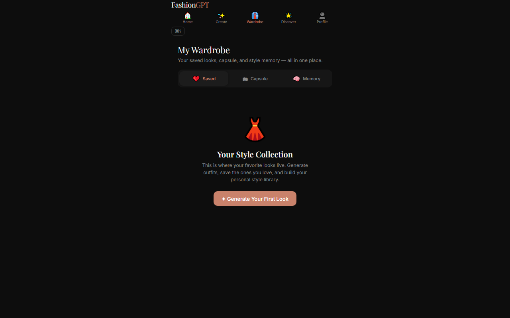
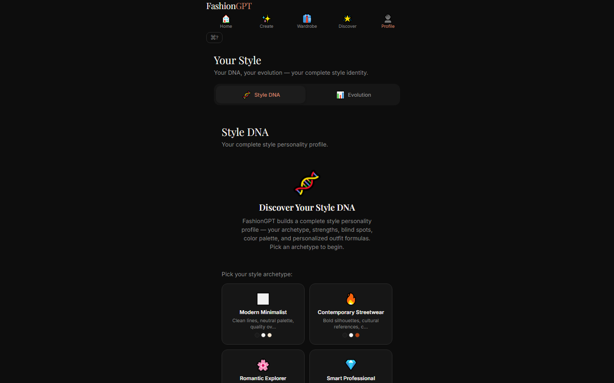
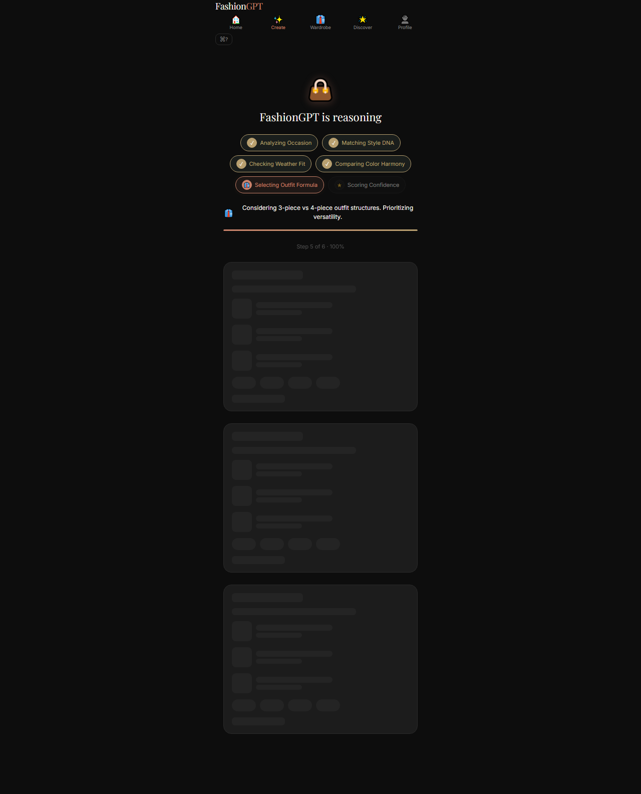

# FashionGPT

**Deterministic AI Stylist — Explainable, Offline-Capable, Multi-Brand**

FashionGPT is an intelligence-first outfit recommendation app for the Inditex ecosystem (Zara, Pull&Bear, Bershka, Stradivarius, Massimo Dutti, Oysho). Unlike a black-box chatbot, **every recommendation includes a visible reasoning trace**: why this occasion maps to this formality, why these colors harmonize, why this silhouette fits your archetype, and what confidence the system has in each dimension.

[](https://github.com/hexfix/fashiongpt/actions/workflows/ci.yml)

> 🔗 **Live demo**: *coming soon — see Deployment*
>
> 
> *Home — weather-aware greeting, quick outfit generation, daily style tip*
>
> | Tab | Screenshot |
> |-----|-----------|
> | **Create** |  |
> | **Wardrobe** |  |
> | **Discover** |  |
> | **Profile** |  |
>
> 
> *Generated outfit with full reasoning trace — confidence ring, "why chosen", "what it solves", rejected alternatives, and per-dimension breakdown*

---

## Table of Contents

- [Architecture](#architecture)
- [Features](#features)
- [Explainable-AI Pipeline](#explainable-ai-pipeline)
- [Tech Stack](#tech-stack)
- [Getting Started](#getting-started)
- [Project Structure](#project-structure)
- [Deployment](#deployment)
- [License](#license)

---

## Architecture

FashionGPT runs in **two tiers** with a **dual-mode engine**:

```
┌────────────────────────────────────────────────┐
│                  Frontend (Vite SPA)             │
│                                                  │
│  ┌────────────┐  ┌────────────┐  ┌───────────┐  │
│  │ Rule Engine │  │ Reasoning  │  │  UI Shell  │  │
│  │ (offline)   │  │   Layer    │  │  (5 tabs)  │  │
│  └────────────┘  └────────────┘  └───────────┘  │
│        │                │               │        │
│        ▼                ▼               ▼        │
│  ┌────────────────────────────────────────┐      │
│  │        Config Layer (detects mode)      │      │
│  │   Mock ◀─── no key ──▶ Anthropic Proxy │      │
│  └────────────────────────────────────────┘      │
│                         │                         │
└─────────────────────────┼─────────────────────────┘
                          │ POST /api/generate
                          ▼
              ┌──────────────────────┐
              │  Express Proxy (server/) │
              │  ANTHROPIC_API_KEY    │
              └──────────────────────┘
                          │
                          ▼
              ┌──────────────────────┐
              │  Anthropic Messages  │
              │  API (claude-sonnet) │
              └──────────────────────┘
```

**Dual-mode design**: When no API key is configured, the app runs entirely client-side using a deterministic rule engine — no external calls, no loading spinners. When a proxy is available, the engine's outputs are enhanced by Claude for richer variety. All reasoning is computed and rendered client-side in both modes.

---

## Features

### 5-Tab Navigation

| Tab | What it does |
|-----|-------------|
| **Home** | Weather-aware greeting, quick outfit generation, favorite outfits carousel, daily style tip |
| **Create** | Multi-step outfit generator: occasion → archetype → color preference → reasoning breakdown |
| **Wardrobe** | Saved looks (localStorage), capsule wardrobe builder, style memory panel with timeline |
| **Discover** | Archetype profiles with product matches + seasonal trend radar with direction bars |
| **Profile** | FashionDNA assessment (archetype quiz & palette) + Style Evolution (past looks timeline) |

### Key Experiences

- **Occasion-first generation** — Pick an occasion (wedding, office, beach, festival...) and the system builds a complete look with formality matching
- **Weather-aware styling** — Live weather data (or mock data for Madrid) adjusts fabric, layering, and color temperature recommendations
- **Capsule wardrobe builder** — Generates a 10-piece cross-brand capsule with total cost and outfit combinatorics
- **Trend radar** — Live-style bars showing seasonal movements (rising/falling/peaked) per category
- **FashionDNA quiz** — Determines your archetype, personal palette, confidence scores, and wardrobe gap
- **Color harmony engine** — Scores outfit color pairs by wheel position (complementary, analogous, triadic, monochromatic)
- **Explainable reasoning** — Every recommendation shows *why* it was chosen and *what styling problem* it solves (see below)

---

## Explainable-AI Pipeline

Every outfit card surfaces a multi-dimensional reasoning trace rendered entirely on the client. No API calls are needed for this — it uses the rule engine's internal scores.

```
Generation Flow:
  Occasion ──▶ DNA ──▶ Weather ──▶ Color ──▶ Formula ──▶ Confidence
     │           │          │          │           │            │
     ▼           ▼          ▼          ▼           ▼            ▼
  formality   archetype  temp adj  pair score  silhouette   avg score
  mapping     matching   fabric     wheel pos  category     0-100%
```

**Rendered on every outfit card:**
- **Confidence ring** — SVG donut chart (0–100%) showing overall conviction
- **"Why this was chosen"** — Natural-language statement linking occasion → archetype → formality
- **"What this solves"** — Context-aware styling challenge this look addresses
- **Rejected alternatives** — 2 alternatives that scored lower, with reasons
- **Per-dimension breakdown** — Confidence %, score, and reasoning text for each of the 6 dimensions

Example reasoning output:

> *"A 'Smart Casual' look for your office occasion. The slim-fit blazer adds structure (scoring 88% confidence for your Minimalist archetype), while the neutral palette adapts well to Madrid's 22°C weather. Avoids the overly formal suiting alternative that would mismatch the occasion's 'relaxed professional' expectation."*

---

## Tech Stack

| Layer | Technology |
|-------|-----------|
| UI | React 18, Vite 5, vanilla CSS (no UI library) |
| Language | TypeScript 5 (strict mode) |
| Routing | Hash-based SPA (no router library) |
| State | React context + hooks |
| Offline engine | 6 deterministic rule modules (TypeScript) |
| AI provider | Anthropic Claude (via Express proxy) |
| Backend proxy | Express.js (server/) |
| Testing | Vitest, React Testing Library |
| Persistence | localStorage / optional Supabase |
| CI | GitHub Actions (test + build + tsc) |

---

## Getting Started

### Prerequisites

- Node.js 18+
- npm 9+

### 1. Install

```bash
npm install
```

### 2. Configure

Copy the example environment file:

```bash
cp .env.example .env.local
```

FashionGPT runs **fully offline** with zero configuration. If you want live features:

| Feature | What to set | Where |
|---------|------------|-------|
| AI-enhanced generation | `ANTHROPIC_API_KEY` | `server/.env` |
| Live weather | `VITE_OPENWEATHER_API_KEY` | `.env.local` |
| Account persistence | `VITE_SUPABASE_URL` + `VITE_SUPABASE_ANON_KEY` | `.env.local` |

### 3. Start (two terminals)

```bash
# Terminal 1 — Backend proxy (optional, only needed for AI features)
cd server
cp ../.env.example .env    # or create server/.env with ANTHROPIC_API_KEY
npm install
node index.js

# Terminal 2 — Frontend dev server
npm run dev
```

Open [http://localhost:5173](http://localhost:5173).

### 4. Build

```bash
npm run build
npm run preview
```

---

## Project Structure

```
fashiongpt-project/
├── public/                  # Static assets
├── server/
│   ├── index.js             # Express proxy (secures Anthropic key)
│   └── package.json
├── src/
│   ├── components/          # 29 React components
│   │   ├── HomeScreen.jsx
│   │   ├── OutfitGenerator.jsx
│   │   ├── OutfitCard.jsx
│   │   ├── Wardrobe.jsx
│   │   ├── Profile.jsx
│   │   ├── GeneratingAnimation.jsx  # 6-stage reasoning pipeline UI
│   │   └── ...
│   ├── rules/               # 6 deterministic rule engines (TypeScript)
│   │   ├── styleRules.ts    # Archetype profiles & tag matching
│   │   ├── occasionRules.ts # Occasion → formality mapping
│   │   ├── weatherRules.ts  # Temperature → fabric/layer/palette
│   │   ├── colorRules.ts    # Color wheel harmony scoring
│   │   ├── outfitEngine.ts  # Outfit generation orchestrator
│   │   └── index.ts         # Barrel export
│   ├── services/            # API clients & config
│   ├── data/                # Product catalogs & static data
│   ├── hooks/               # Custom React hooks
│   ├── db/                  # Supabase client (optional)
│   ├── context/             # React context providers
│   └── __tests__/           # Test suite (34 tests)
├── docs/                    # Architecture & product docs
├── .env.example             # Single source of truth for env vars
├── .github/workflows/       # CI pipeline
├── LICENSE
├── package.json
└── vite.config.js
```

---

## Deployment

[](https://vercel.com/import/project?template=hexfix/fashiongpt)

### Frontend (Vercel / Netlify)

```bash
npm run build
```

Deploy the `dist/` folder. Set `VITE_API_PROXY_URL` to your deployed proxy URL. No other env vars needed — the app works in offline mode with zero config.

The `vercel.json` file in the root handles SPA routing so direct URLs to any tab work correctly.

### Backend (Vercel serverless)

To use AI-powered generation in production:

1. Deploy `server/index.js` as a [Vercel serverless function](https://vercel.com/docs/functions/serverless-functions)
2. Set `ANTHROPIC_API_KEY` as an environment variable in the Vercel dashboard
3. Set `VITE_API_PROXY_URL` in the frontend to point to your deployed function URL

---

## Testing

```bash
npm test          # 34 tests (Vitest + RTL)
npm run build     # Vite production build (0 errors)
npx tsc --noEmit  # TypeScript strict check (0 errors)
```

---

## License

MIT — see [LICENSE](LICENSE).

---

*Built with React, TypeScript, and Claude. Not affiliated with Inditex, Zara, or Anthropic. Product data is illustrative.*
